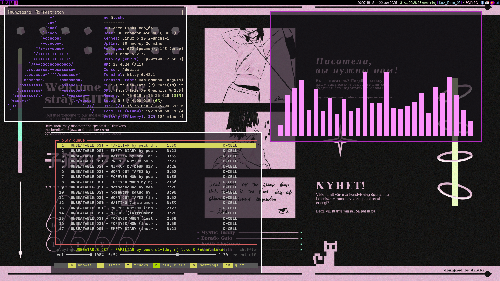
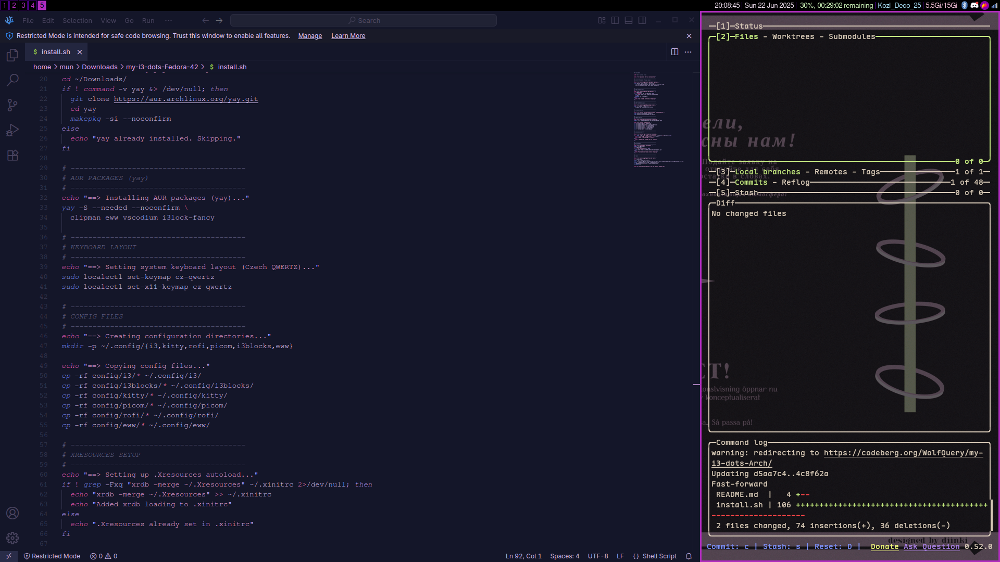

# 🌿 My i3 Dots for Arch Linux

Minimal, aesthetic rice for Arch Linux with i3, Kitty, Rofi, Eww, and more.

---

## 🚀 Installation

> ⚠️ This script will install missing dependencies and copy over your config files.  
> Make sure to back up any existing dotfiles if needed.

Clone the repo and run the installer:

```bash
git clone https://codeberg.org/WolfQuery/my-i3-dots-Arch.git
cd my-i3-dots-Arch
chmod +x install.sh
./install.sh
````

> 🛠️ You will be prompted for your password when installing packages.

---

## 🖥️ Included

* Window Manager: `i3`
* Terminal: `kitty`
* Launcher: `rofi`
* Compositor: `picom`
* System Bar: `i3blocks` + `eww`
* File Manager: `thunar`
* Notifications: `dunst`
* System Tools: `fastfetch`, `cava`, `htop`, `feh`, `blueman`, `clipman`, etc.
* Font: [Maple Mono NL](https://github.com/subframe7536/maple-font)
* Wallpapers: Custom repo by [diinki](https://github.com/diinki)

---

## 🖼️ Screenshots


---

## 🙏 Credits

### 🎨 Wallpapers

Wallpapers used in this theme are created by the artist [diinki](https://github.com/diinki).
📁 Repo: [`wallpapers`](https://github.com/diinki/wallpapers)
💡 Please **do not redistribute** — download them directly and consider supporting the artist on [Ko-fi](https://ko-fi.com/E1E81FQW4S).

---

### 🔤 Fonts

Font used is [`Maple Mono NL`](https://github.com/subframe7536/maple-font) by [subframe7536](https://github.com/subframe7536).
💡 Please **do not redistribute** — download directly from the original source.

---

### 🔒 Lockscreen

Lockscreen script is based on [`i3lock-fancy`](https://github.com/meskarune/i3lock-fancy) by [meskarune](https://github.com/meskarune).
💡 Please **do not redistribute** — use the upstream repo for the latest version.

---

## 🧪 Disclaimer

This setup is tailored for my personal use.
Feel free to fork, tweak, or use it as inspiration for your own rice, but please respect the licenses of the original creators above.

---

## 📬 Contact / Feedback

Found an issue or have a suggestion? Feel free to open an issue or reach out.